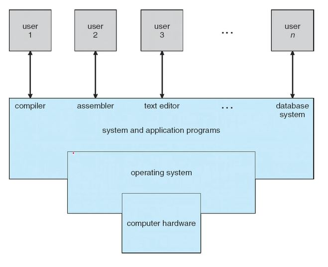
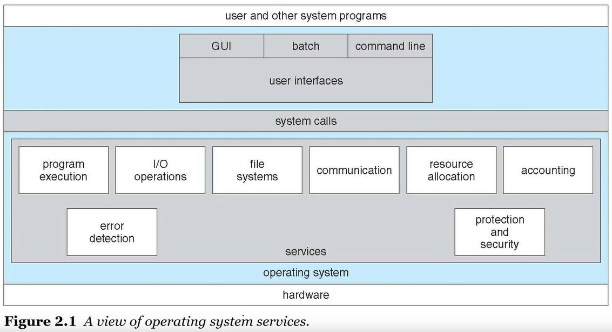

# OS가 하는일
* Application Program과 User, Hardware 간의 중간 매개 역할
* 컴퓨터는 대략 4가지 컴포넌트로 나뉨
    * 하드웨어, OS, App, User
    

# OS의 정의
* 컴퓨터에서 항상 돌아가는 하나의 프로그램
* Kernel(OS의 핵심 프로그램, 시스템의 모든 것을 완전히 통제함)

# 부팅프로그램
* OS를 메모리에 로드하는 프로그램

# Interrupts
* I/O device에서 input이 있을 때 CPU에서 처리
* 하드웨어가 Interrupts를 Trigger 

# 폰노이만 아키텍쳐
* Instruction Set로 구성된 어떤 프로그램을 메모리에 로딩하고 메모리에 있는 Instruction을 CPU로 Fetch하고 CPU에서 Execute 하는 싸이클

# 저장장치의 계층구조
* 저장용량과 접근시간에 따라 나뉨
    * register > cache > RAM > SSD > HDD > optical disk > magnetic tapes

# Symmetric Multiprocessing(SMP)
* 메모리 한개에 연결된 CPU가 여러개(Multi-core design에 비해 비용이 비쌈)

# Multi-core design
* CPU 안에 코어가 여러개

# Multiprogramming
* 여러개의 프로그램을 메모리에 올려 돌림
* CPU 사용 효율 증가

# Multitasking(=Multiprocessing) concurrency
* 하나의 CPU에 여러개의 작업을 시분할(time-sharing)하여 자주 변경하여 돌림
* CPU scheduling 필요: 다음에 실행시킬 프로그램을 선택하는 방법이 필요

# Operations mode
* user mode, kernel mode
* kernel mode 에서만 hardware제어

# 가상화(Virtualization)
* VMM: Virtual Machine Manager
* H/W 한개에 VMM을 이용해 여러개의 OS를 돌림

# 다양한 컴퓨팅 환경
* Mobile, Client-Server(Web), Peer-to-Peer, Cloud, Real-Time Embedded Systems 등

# OS servcies

# OS와 User 간 Interface
* CLI: command line interface(sh, bash, csh...)
* GUi: graphical user interface(Windows, MacOS, GNOME...)
* Touch-Screen Interface(Android, iPhone)

# System Calls
* APP은 OS와 System Call을 통해 interface를 제공함(API라고 부름)
* ex) fork(), wait(), open(), read(), write(), close() ...

